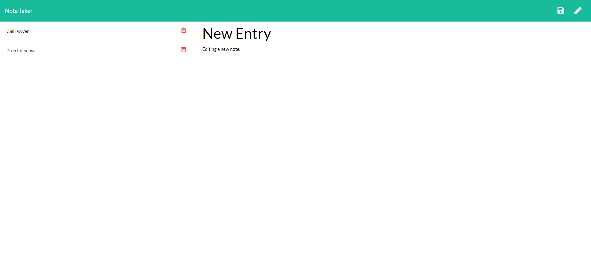

# noteTaker

## Description

This project demonstrates creating an Express server and adding routes to build a Note Taker application and ultimately deploying the application via Heroku.

This application allows a user to add a note title/description and save the information out to a JSON file.  As the user notes are added, they are displayed in the left column along with a delete icon.   If a user clicks any of the existing note titles in left column, then the note is displayed in right side of screen along with its full description.   The user is also able to edit an existing note by clicking the Edit icon in top right corner of screen.

As an adde bonus, delete functionality was added to the application.  If the user clicks the delete icon for a note, then the application deletes that specific note, writes out the shortened list of notes both to the screen and also to the JSON file.

The application utilized an Express server and was deployed through Heroku.

## Table of Contents

* [Screenshots](#Screenshots)
* [Installation](#Installation)
* [Usage](#Usage)
* [Support](#Support)
* [Technologies](#Technologies)
* [Repository](#Repository)

## Screenshots
 
The following is a screenshot of the Note Taker application without any saved notes originally.

  

The following is a screenshot of the Note Taker application with some Notes added.

  

The following is a screenshot of the Note Taker application when a note title is clicked on and displays the text description of the note.

  

The following is a screenshot of the Note Taker application when Edit icon is clicked to enter a new note.

  

The following is a screenshot of the Note Taker application when Delete icon is clicked on existing Note Title.  In this case, the earlier saved Call Lawyer task was deleted and no longer shows.

  

## Installation

* Install node.js to computer, if not already present.
    * Node.js can be installed from [here](https://nodejs.org/en/)
* Copy all the application files in folder 'noteTaker' locally to one's machine.
* In a terminal window where you copied the files, install 'express' using node package manager (npm) as follows:
    * **npm install**

## Usage

This application requires Node.js to be installed.  It also requires the user to have installed 'Express' via npm.  (See [Installation](#installation) section.)  Once these items have been installed, the user can launch the application from a terminal window as follows:

**node server.js**

## Support

Please email me for further information jtoth7824@gmail.com

## Technologies

Node.js

Express

Javascript

npm

Heroku

## Repository

Direct link to repository:  https://github.com/jtoth7824/noteTaker

## Deployment

Direct link to deployed Note Taker application on Heroku:   https://radiant-oasis-92160.herokuapp.com/